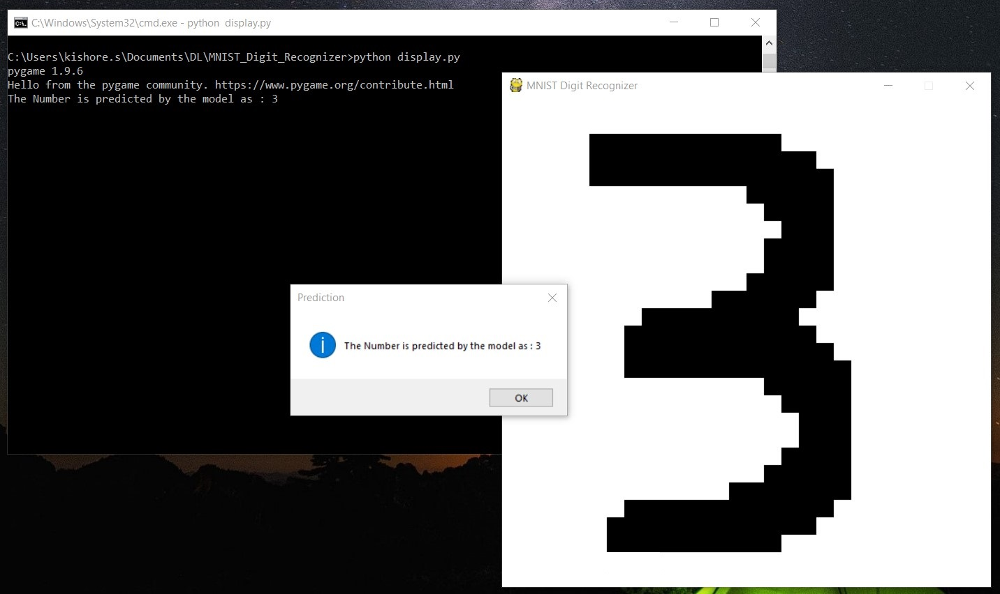

# MNIST-Digit-Recognizer
> MNIST Digit Recognizer is a tool in which we can draw digits (0-9) and the trained CNN Model will predict the number. This project is developed using pygame. The CNN Model has been implemented using Tensorflow.

## Demo


## Project Directory Structure

```
  ├── MNIST-Digit-Recognizer                # Root Folder
    ├── data/                               # Folder which contains the data for CNN Model Training
    ├── imgs/                               # Folder which contains demo image
    ├── model/                              # Folder which contains serialized models and saved model weights
    ├── training/                           # Folder which contains training logs
    ├── .gitignore                          # .gitignore file
    ├── MNIST_CNN_Model.ipynb               # Notebook which contains the CNN Model
    ├── data_utils.py                       # Python file which contains the utils for loading the training data
    ├── display.py                          # Main File of the project
```

## Dependencies
* cv2
* numpy
* pandas
* sklearn
* pygame
* matplotlib
* tensorflow

> Install all the dependencies before running the display file.

## Installation
1. Clone the repository into a folder
```
$ git clone https://github.com/kishore-s-15/MNIST-Digit-Recognizer.git
```
2. Then run the following command from the project directory
```
python display.py (or) python3 display.py
```
